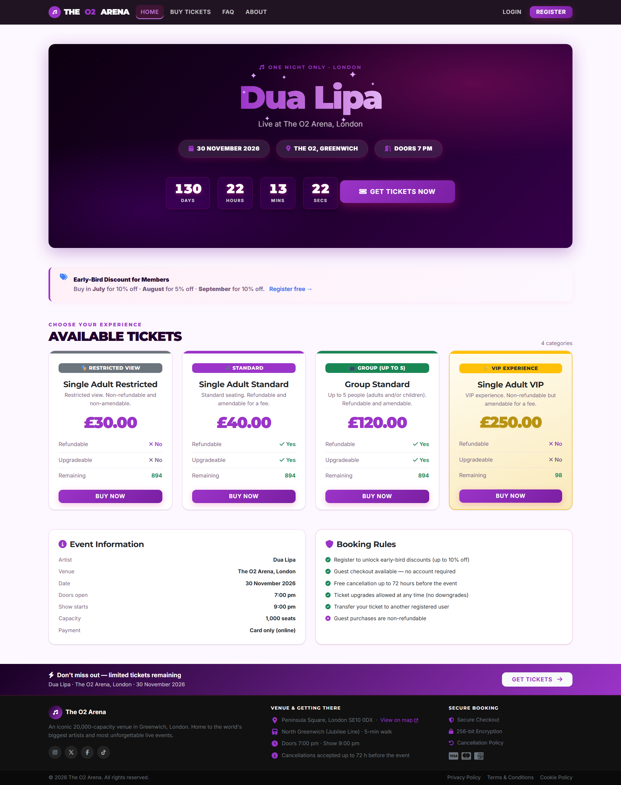
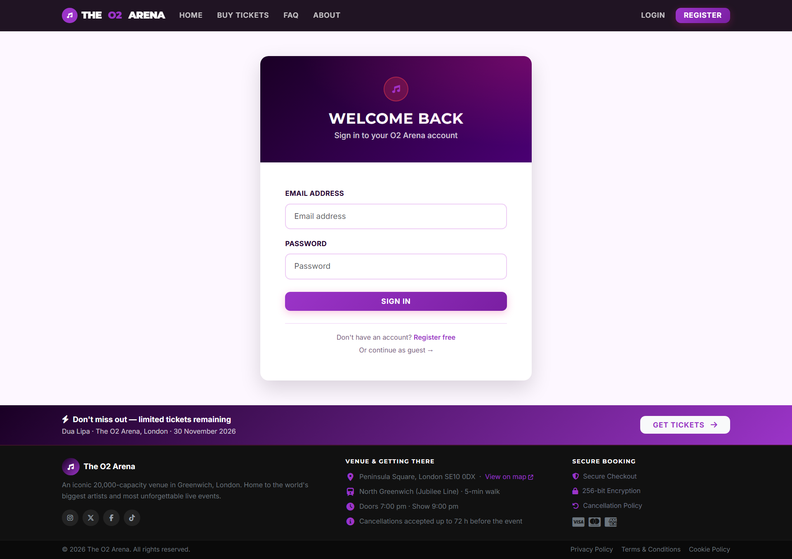
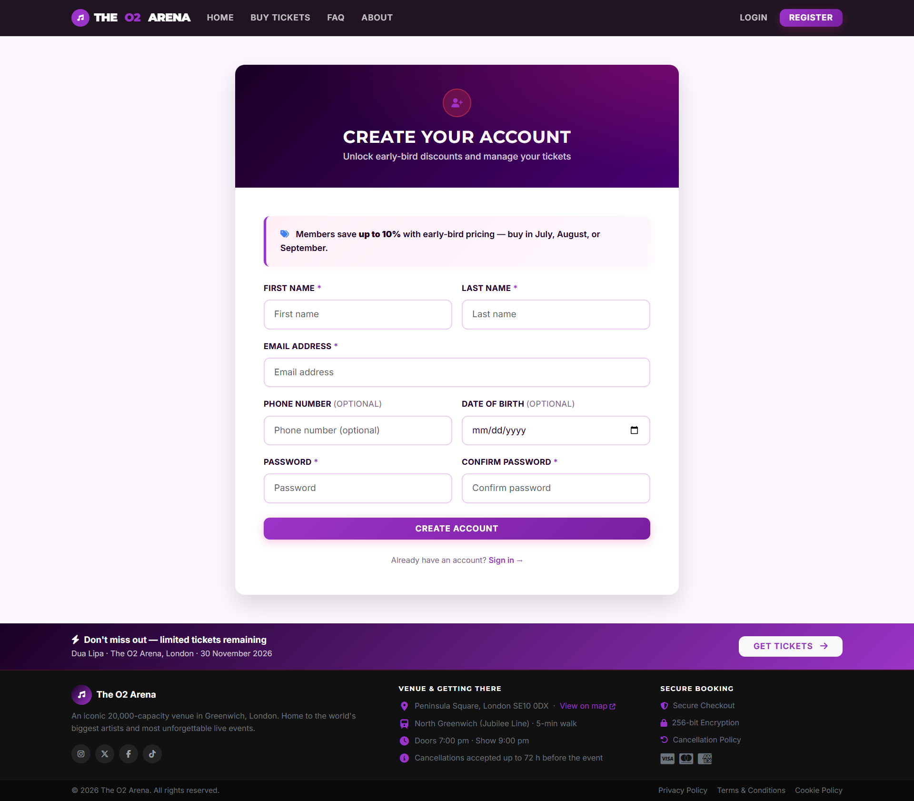

# 🎵 The O2 Arena – Ticket System

A full-stack Django ticket sales and management system. Handles the complete ticket lifecycle — from browsing and purchase through to QR-code check-in at the venue — with a full admin backend for staff.

---

## Table of Contents

- [Screenshots](#screenshots)
- [Tech Stack](#tech-stack)
- [Features](#features)
- [Project Structure](#project-structure)
- [Data Models](#data-models)
- [Ticket Categories](#ticket-categories)
- [Discount System](#discount-system)
- [Business Rules](#business-rules)
- [URL Namespaces](#url-namespaces)
- [Getting Started](#getting-started)
- [Environment Variables](#environment-variables)
- [Running Tests](#running-tests)
- [Admin Access](#admin-access)
- [Development Notes](#development-notes)
- [Deployment Checklist](#deployment-checklist)
- [License](#license)

---

## Screenshots

| Home Page | Login Page | Register Page |
|---|---|---|
|  |  |  |

---

## Tech Stack

| Layer          | Technology | Version |
|----------------|---|---|
| Language       | Python | 3.11+ |
| Framework      | Django | 4.2+ |
| Database       | MySQL (XAMPP/phpMyAdmin locally) | 8.0+ |
| Front-end      | HTML, CSS, JavaScript (Django templates + Bootstrap 5.3.2) | — |
| Static files   | WhiteNoise | 6.6+ |
| PDF generation | ReportLab | 4.0+ |
| QR codes       | qrcode | 7.4+ |
| Payments       | Stripe (simulated in dev) | 7.0+ |

---


## Features

### Customer-Facing
- **Browse tickets** — 4 categories with live availability and sold-out detection
- **Live countdown** — ticking timer on the homepage counting down to the event
- **Guest checkout** — purchase without creating an account
- **Registered accounts** — unlock early-bird discounts and full ticket management
- **My Tickets** — view all purchased tickets with downloadable QR codes
- **Cancel** — free cancellation within the allowed window; refund issued automatically
- **Upgrade** — move to a higher-priced category at any time (no downgrades)
- **Transfer** — send a ticket to another registered user
- **Waitlist** — join a queue when sold out; auto-notified when a spot becomes available

### Admin Backend
- **Dashboard** — live stats (total revenue, tickets sold, per-category breakdown); results cached 30 seconds
- **Ticket management** — search, filter, and view full detail for every order
- **Reports** — streaming CSV export using chunked queries (memory-safe for large datasets)
- **QR scanner** — camera-based scanner with duplicate check-in guard
- **PDF receipts** — generated with ReportLab and emailed on purchase

### Security & Reliability
- `select_for_update()` on ticket inventory to prevent overselling under concurrent load
- Payment simulation gated behind `DEBUG=True` **and** a placeholder Stripe key — never runs in production accidentally
- `admin_required` decorator checks both `is_staff` **and** `is_active`
- PII (email, amount) stripped from QR scanner API responses
- Receipt emails sent **outside** database transactions with per-order exception handling — one failed email never rolls back a successful purchase
- Structured logging across three namespaces: `frontend`, `backend`, `core`

---

## Project Structure

```
ticket_system/
│
├── config/              # Django settings, root URLs, WSGI
├── core/                # Shared utilities used across the whole project
│   ├── management/      # Custom Django management commands
│   ├── payment/         # Stripe gateway + refund helpers
│   └── utils/           # Dates, PDF, QR code, email, validators
│
├── frontend/            # Customer-facing Django apps
│   ├── accounts/        # Register, login, profile, password change
│   ├── home/            # Homepage, FAQ, About
│   ├── ticket_sales/    # Browse categories, select seats, waitlist
│   ├── checkout/        # Payment, order creation, confirmation
│   └── my_tickets/      # View, cancel, upgrade, transfer tickets
│
├── backend/             # Staff-only Django apps
│   ├── dashboard/       # Live stats dashboard (cached)
│   ├── ticket_admin/    # Search and manage all orders
│   ├── reports/         # Streaming CSV export
│   └── qr_scanner/      # Camera-based QR check-in
│
├── templates/           # HTML templates (one folder per app)
├── static/              # CSS, JavaScript
├── media/               # Generated QR codes and PDF tickets
│
├── manage.py
└── requirements.txt
```

---

## Data Models

| Model | App | Purpose |
|---|---|---|
| `CustomUser` | accounts | Extends `AbstractUser` — adds phone number, date of birth |
| `TicketCategory` | ticket_sales | Category definition: price, capacity, type, refundable/amendable flags |
| `Ticket` | ticket_sales | Individual purchased ticket with generated QR code |
| `TicketHolder` | ticket_sales | Buyer details (name, email) — supports guest checkout |
| `WaitlistEntry` | ticket_sales | Waitlist queue per category per email; unique together constraint |
| `Order` | checkout | Groups tickets into a single purchase session |
| `Payment` | checkout | Payment record: amount, status, Stripe reference |
| `Refund` | checkout | Refund record linked to an order |

All core models inherit from `TimeStampedModel` which adds `created_at` and `updated_at` automatically.

---

## Ticket Categories

| Category | Price | Refundable | Upgradeable | Pool |
|---|---|---|---|---|
| Single Adult Restricted | £30 | ✗ | ✗ | Shared |
| Single Adult Standard | £40 | ✓ | ✓ | Shared |
| Group Standard (up to 5) | £120 | ✓ | ✓ | Shared |
| Single Adult VIP | £250 | ✗ | ✓ | Separate |

Standard, Restricted, and Group categories all draw from a **shared non-VIP ticket pool**. VIP has its own separate capacity.

---

## Discount System

Registered members receive automatic early-bird discounts based on the month of purchase:

| Month | Registered Member | Staff | Guest |
|---|---|---|---|
| July | 10% off | 10% off | No discount |
| August | 5% off | 10% off | No discount |
| September | 10% off | 10% off | No discount |
| October – November | Full price | 10% off | No discount |

Discounts are calculated at checkout and stored on the order — they are not recalculated retroactively.

---

## Business Rules

### Cancellation
- Cancellations are allowed up to **72 hours before doors open (7:00 pm on event day)**
- After that window closes, only staff (`is_staff`) can force a cancellation
- Already-cancelled tickets cannot be cancelled again
- On cancellation, the next person on the waitlist is automatically notified by email

### Refunds
- Refunds are only issued for tickets marked `is_refundable = True` on the category
- Guest purchases are **never refundable**, regardless of category
- Staff can bypass refund eligibility checks

### Upgrades
- Tickets can be upgraded to any higher-priced category
- Downgrades are not permitted
- VIP tickets cannot be amended (they are already the highest tier)
- Cancelled tickets cannot be upgraded

### Transfers
- Tickets can be transferred to any other **registered** user
- Guests cannot receive a transferred ticket
- Transfer is permanent and cannot be undone

---

## URL Namespaces

| Namespace | Prefix | Audience | Description |
|---|---|---|---|
| `home` | `/` | Public | Homepage, FAQ, About |
| `accounts` | `/accounts/` | Public | Register, login, profile, password change |
| `ticket_sales` | `/tickets/` | Public | Browse categories, select seats, waitlist |
| `checkout` | `/checkout/` | Public | Payment, confirmation, receipt |
| `my_tickets` | `/my-tickets/` | Authenticated | View, cancel, upgrade, transfer tickets |
| `dashboard` | `/admin-panel/` | Staff only | Stats dashboard |
| `ticket_admin` | `/ticket-admin/` | Staff only | Ticket search and management |
| `reports` | `/reports/` | Staff only | CSV export |
| `qr_scanner` | `/scanner/` | Staff only | QR check-in scanner |

---

## Getting Started

### Prerequisites

- Python 3.11+
- pip
- MySQL 8.0+ (XAMPP is supported locally)

### Installation

```
# 1. Clone the repository
git clone <repo-url>
cd ticket_system

# 2. Install dependencies
pip install -r requirements.txt

# 3. Create the MySQL database (default: o2concert_db), then apply migrations
python manage.py migrate

# 4. Add the four ticket categories
python manage.py seed_data

# 5. Create a staff/superuser account for admin access
python manage.py createsuperuser

# 6. Start the development server
python manage.py runserver
```

The app will be available at `http://127.0.0.1:8000`.

---

## Environment Variables

| Variable | Required | Description |
|---|---|---|
| `SECRET_KEY` | Yes | Django secret key — keep this private |
| `DEBUG` | No | `True` in development; **never** `True` in production |
| `DB_NAME` | No | MySQL database name (default: `o2concert_db`) |
| `DB_USER` | No | MySQL username (default: `root`) |
| `DB_PASSWORD` | No | MySQL password (empty by default for local XAMPP) |
| `DB_HOST` | No | MySQL host (default: `127.0.0.1`) |
| `DB_PORT` | No | MySQL port (default: `3306`) |
| `STRIPE_SECRET_KEY` | Production | Live Stripe secret key |
| `STRIPE_PUBLISHABLE_KEY` | Production | Live Stripe publishable key |
| `EMAIL_HOST` | Production | SMTP host for sending receipts |
| `EMAIL_HOST_USER` | Production | SMTP username |
| `EMAIL_HOST_PASSWORD` | Production | SMTP password |

In development with `DEBUG=True` and a placeholder Stripe key, payments are simulated automatically — no real Stripe account needed.

---

## Running Tests

```
cd ticket_system
python manage.py test
```

**31 tests — all passing.** Test coverage spans:

| Area | What is tested |
|---|---|
| Cancellation | Permission window, admin bypass, already-cancelled guard |
| Refunds | Non-refundable categories, guest ineligibility, staff override |
| Upgrades | VIP exclusion, cancelled ticket guard, restricted category |
| Auth decorator | Non-staff redirect, inactive staff blocked, staff access granted |
| Discount logic | All months, guest vs. registered vs. staff pricing |
| Availability | Shared non-VIP pool, pool exhaustion, sold-out detection |
| Checkout | Session guard redirects, 404 on invalid order reference |

---

## Admin Access

Staff accounts have access to a dedicated backend at `/admin-panel/`. The navbar shows an **Admin** dropdown when logged in with a staff account.

| Section | URL | What you can do |
|---|---|---|
| Dashboard | `/admin-panel/` | View revenue, ticket counts, category breakdown |
| Ticket Management | `/ticket-admin/` | Search, filter, view full order detail |
| Reports | `/reports/` | Export all orders as a streaming CSV |
| QR Scanner | `/scanner/` | Scan attendee QR codes to check them in |
| Django Admin | `/django-admin/` | Direct database access for superusers |

To create a staff account:
```
python manage.py createsuperuser
```
Or promote an existing user via Django Admin: go to Users and set `is_staff = True`.

---

## Development Notes

### Payment Simulation
Real Stripe calls are only made when both conditions are true:
- `DEBUG = False`
- `STRIPE_SECRET_KEY` is a real key (not the placeholder `sk_test_placeholder`)

In local development, payments are simulated and complete instantly.

### Database
MySQL is used in development and production. Local development can use MySQL from XAMPP/phpMyAdmin. Connection details come from the `DB_NAME`, `DB_USER`, `DB_PASSWORD`, `DB_HOST`, and `DB_PORT` environment variables, with local defaults in `config/settings.py`.

### Logging
All significant actions are logged to the console with timestamps and log levels. Three named loggers are configured:

| Logger | Covers |
|---|---|
| `frontend` | Ticket purchases, cancellations, upgrades, transfers |
| `backend` | Dashboard queries, QR check-ins, CSV exports |
| `core` | Auth, decorator decisions |

### Static Files
WhiteNoise serves static files in both development and production — no separate web server (e.g. nginx) is needed for static file serving.

---

## Deployment Checklist

Before going live, update the following:

- [ ] Set `DEBUG = False` in `settings.py`
- [ ] Set a strong, unique `SECRET_KEY`
- [ ] Replace `STRIPE_SECRET_KEY` and `STRIPE_PUBLISHABLE_KEY` with live keys
- [ ] Update `ALLOWED_HOSTS` to your production domain
- [ ] Update `CSRF_TRUSTED_ORIGINS` to your production domain
- [ ] Create and back up the production MySQL database
- [ ] Set the production `DB_NAME`, `DB_USER`, `DB_PASSWORD`, `DB_HOST`, and `DB_PORT`
- [ ] Configure `EMAIL_HOST`, `EMAIL_HOST_USER`, `EMAIL_HOST_PASSWORD` for real email delivery
- [ ] Set `X_FRAME_OPTIONS` back to `'DENY'` (currently `ALLOWALL` for the dev preview)
- [ ] Run `python manage.py collectstatic`
- [ ] Run `python manage.py migrate` against the production database

---

## License

This project is for educational and demonstration purposes.
